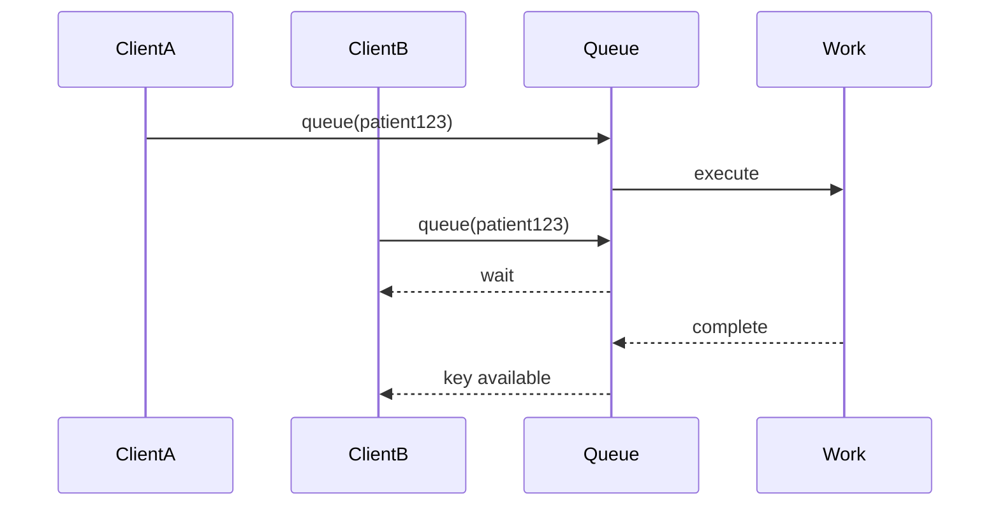
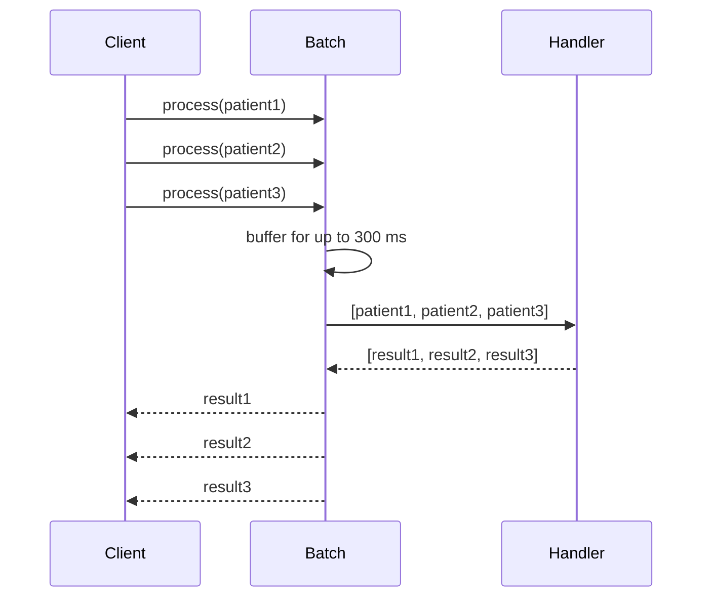
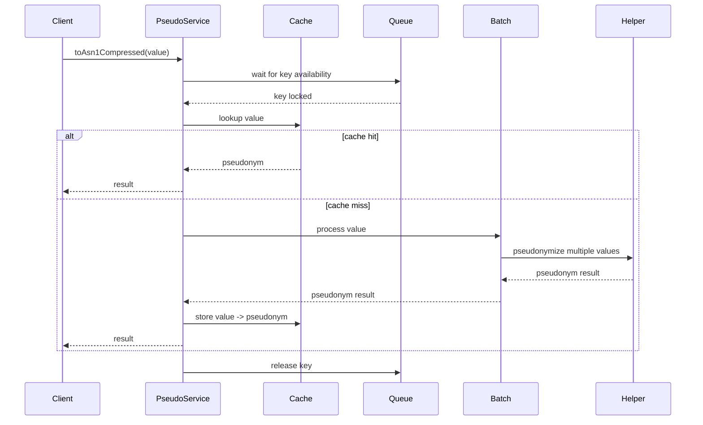
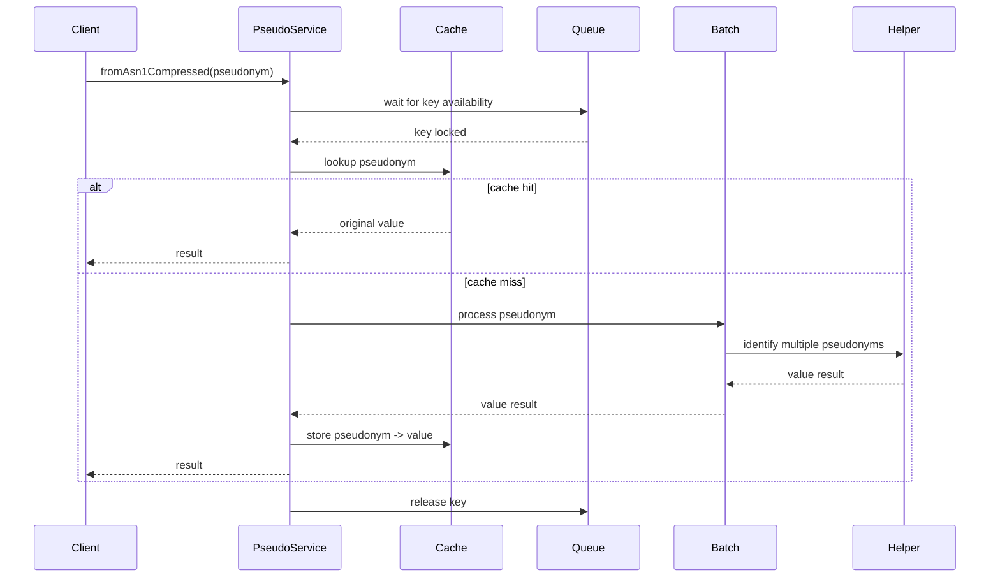

# Architecture

`@smals-belgium/shared-pseudo-tools-js` is a framework-agnostic reactive wrapper around `@smals-belgium-shared/pseudo-helper`.

It adds three optimization layers around the underlying pseudonymization helper:

- TTL cache lookup and storage
- per-key queueing for identical requests
- automatic batching for concurrent requests

These layers reduce duplicate work and improve throughput when many pseudonymization or identification requests are triggered close together.

---

## High-level overview

```text
                         +----------------------+
                         |   Application Code   |
                         +----------+-----------+
                                    |
                                    v
                         +----------------------+
                         |    PseudoService     |
                         +----------+-----------+
                                    |
               +--------------------+--------------------+
               |                    |                    |
               v                    v                    v
     +----------------+   +----------------+   +----------------+
     | Cache Service  |   | Queue Service  |   | Batch Service  |
     +----------------+   +----------------+   +----------------+
                                    |
                                    v
                    +-------------------------------+
                    | PseudonymisationHelper        |
                    | (@smals-belgium-shared)       |
                    +-------------------------------+
```

---

## Main components

### PseudoService

`PseudoService` is the public API of the library.

It coordinates:

- string pseudonymization
- string identification
- batch pseudonymization
- batch identification
- byte-array pseudonymization
- byte-array identification
- cache lookup and storage
- queueing
- batch orchestration
- expiration checks

The service is intentionally not an Angular service. In Angular projects, wrap it in an application-level injectable service.

---

### PseudoCacheService

`PseudoCacheService` stores recently processed values in memory using `@isaacs/ttlcache`.

It maintains two independent caches:

```text
value     -> pseudonym
pseudonym -> value
```

Default TTL:

```text
10_000 ms
```

The TTL can be overridden through `PseudoConfig.cache` or per entry when the pseudonym itself contains an expiration timestamp.

The implementation enables `checkAgeOnGet`, so expired entries are rejected when they are read.

---

### QueueService

`QueueService` serializes processing for identical keys.

Its job is not to batch requests. Its job is to prevent concurrent processing of the same key.

Example:

```text
Request A -> patient123
Request B -> patient123
Request C -> patient123
```

The first request locks the key. Later requests wait until the key is released. Once the first request completes, waiting requests can re-check the cache and either return the cached value or start a new operation.



---

### PseudoBatchService

`PseudoBatchService` aggregates distinct in-flight requests into a single batch operation.

Current buffering strategy:

```ts
bufferTime(300, undefined, 10);
```

| Parameter      | Value  | Meaning                                  |
| -------------- | ------ | ---------------------------------------- |
| Time window    | 300 ms | Flush after this duration                |
| Max batch size | 10     | Flush earlier when this size is reached |

The batch service deduplicates identical in-flight items with a `Subject` map. It does not keep completed observables in a persistent cache. Completed subjects are removed after dispatch, which prevents later calls from subscribing to already-completed observables.



If the handler errors, all subjects waiting for that batch receive the error. If the handler does not return an array or returns fewer results than requested, the affected subjects receive an explicit error.

---

## Pseudonymization flow



---

## Identification flow



---

## Byte-array flow

Binary content is converted to Base64 for queueing and batching.

```text
Uint8Array -> Base64 string -> pseudonymization
```

The reverse operation returns the original bytes:

```text
pseudonym -> Value -> Uint8Array
```

String values and byte-array values use separate cache key namespaces internally to avoid collisions between a real string and the Base64 representation of a byte array.

---

## Error handling

The underlying helper may return `EHealthProblem` values. The service converts them to standard JavaScript `Error` instances:

```ts
throw new Error(problem.title, {
  cause: problem.detail,
});
```

The detection also supports object-shaped `EHealthProblem` values. This is useful when a consuming application accidentally loads more than one copy of the helper package, because `instanceof EHealthProblem` may not match across package boundaries.

Batch-level errors are propagated to all subjects waiting for the failed batch.

---

## Empty input handling

Batch public methods support empty arrays.

```ts
service.toAsn1CompressedMultiple([]);      // emits []
service.fromAsn1CompressedMultiple([]);    // emits []
```

The service avoids `forkJoin([])` completing without a value by returning `of([])` for empty chunk lists.

---

## Destroy lifecycle

When the service is no longer needed:

```ts
service.onDestroy();
```

This emits and completes the internal destroy subject, stopping batch pipelines using `takeUntil`.

Do not reuse the same service instance after `onDestroy()`.

---

## Performance characteristics

### Cache hit

```text
request -> cache -> result
```

No helper call is needed.

### Identical concurrent request

```text
request A -> executes
request B -> waits for same key
```

The waiting request can reuse the cache after the first request finishes.

### Distinct concurrent requests

```text
patient1 + patient2 + patient3 -> one batch
```

Requests arriving during the same buffer window are grouped into one helper batch call.

---

## Design goals

- Provide a small RxJS API
- Keep the library framework-agnostic
- Avoid duplicate concurrent processing
- Reduce helper/backend calls with batching
- Avoid stale completed observables in batching internals
- Cache short-lived results safely
- Support both string and byte-array workflows
- Remain compatible with `@smals-belgium-shared/pseudo-helper`
