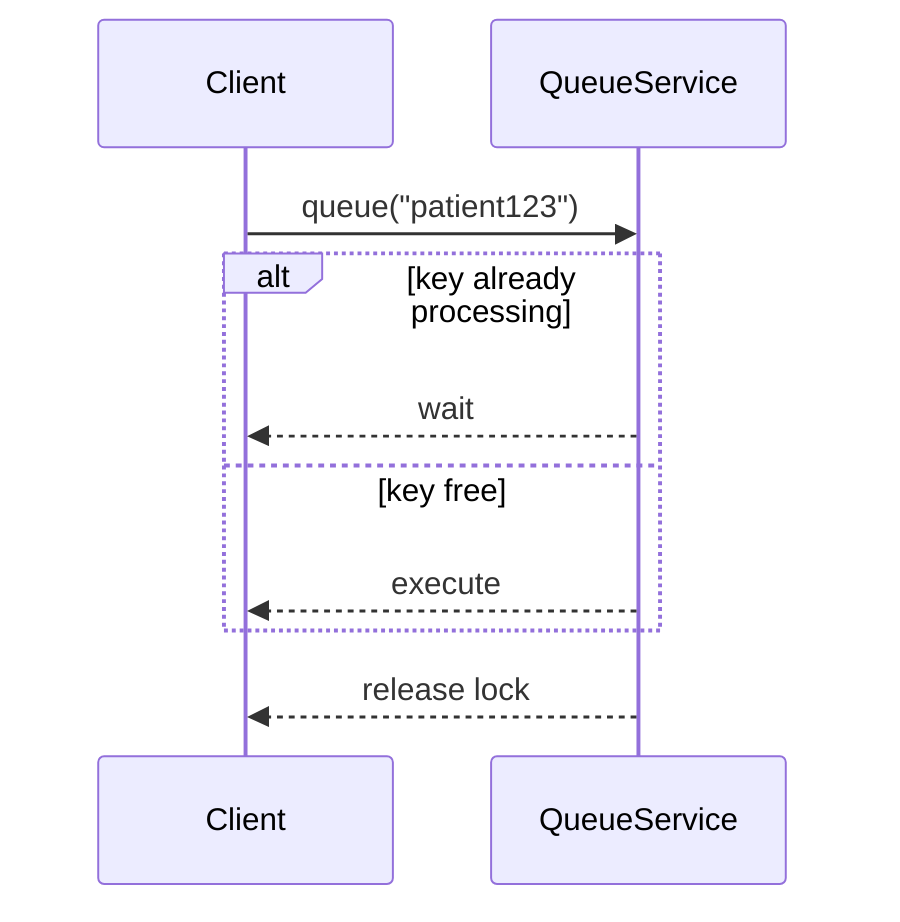
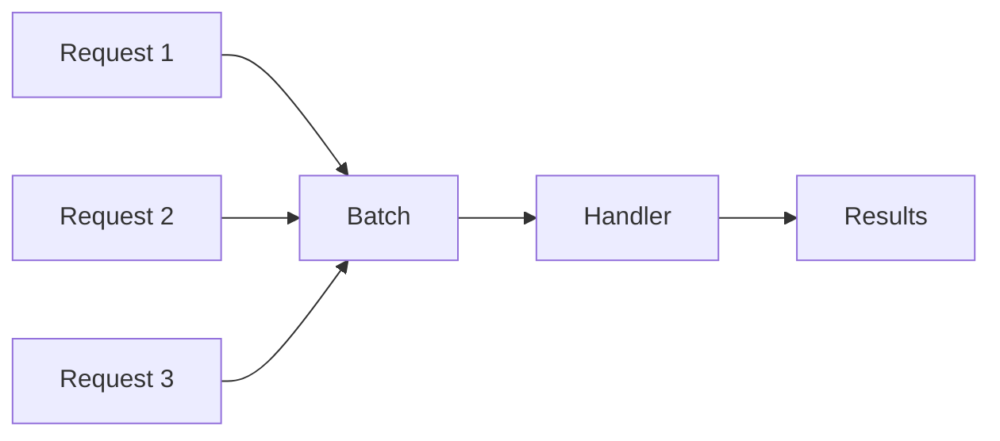
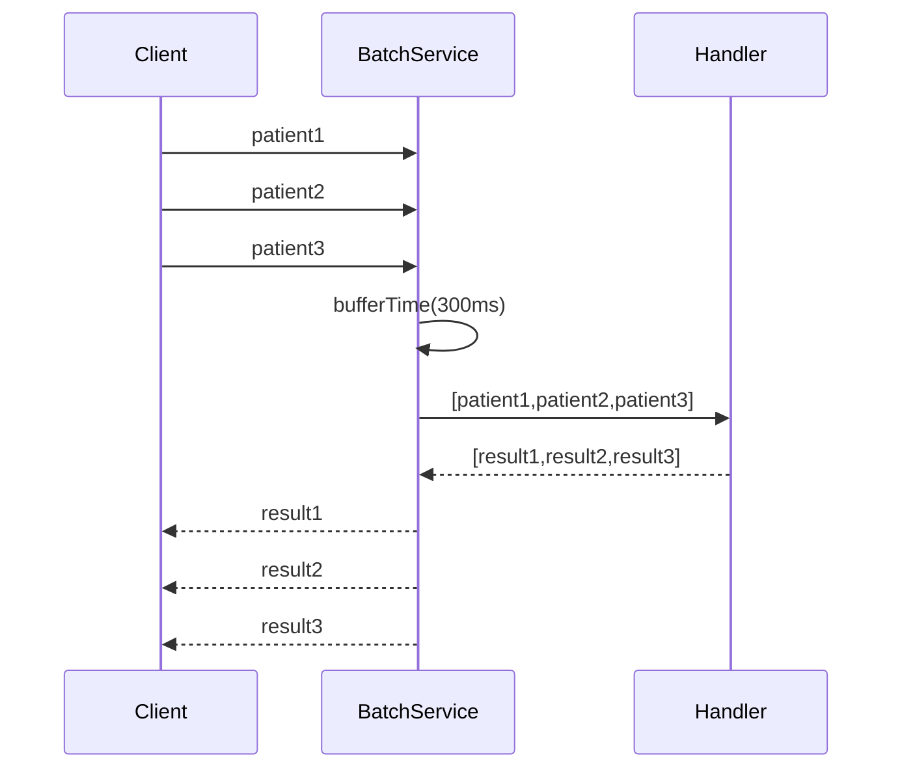
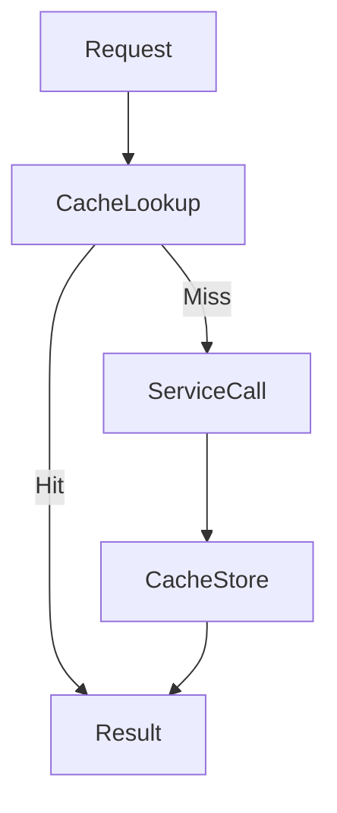
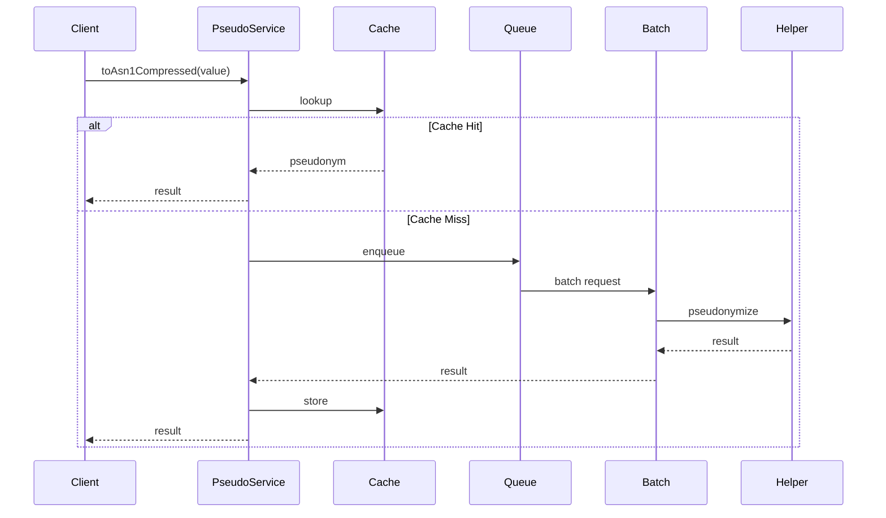
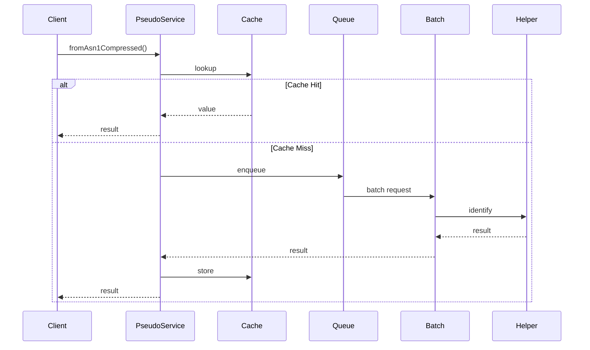

# Architecture

## Overview

`@smals-belgium/shared-pseudo-tools-js` is a reactive wrapper around `@smals-belgium-shared/pseudo-helper`.

The library adds three major optimizations on top of the underlying pseudonymization service:

- Request deduplication
- Automatic batching
- In-memory caching

These optimizations significantly reduce network traffic and improve throughput when large numbers of pseudonymization requests are executed concurrently.

---

# High-Level Architecture

```text
                         +----------------------+
                         |   Application Code   |
                         +----------+-----------+
                                    |
                                    v
                         +----------------------+
                         |    PseudoService     |
                         +----------+-----------+
                                    |
               +--------------------+--------------------+
               |                    |                    |
               v                    v                    v
     +----------------+   +----------------+   +----------------+
     | Cache Service  |   | Queue Service  |   | Batch Service  |
     +----------------+   +----------------+   +----------------+
               |                    |                    |
               +--------------------+--------------------+
                                    |
                                    v
                    +-------------------------------+
                    | PseudonymisationHelper        |
                    | (@smals-belgium-shared)       |
                    +---------------+---------------+
                                    |
                                    v
                        External Pseudonymization
                                Service
```

---

# Main Components

## PseudoService

`PseudoService` is the public API exposed by the library.

Responsibilities:

- Pseudonymization
- Identification
- Batch pseudonymization
- Batch identification
- Byte array support
- Cache management
- Queue management
- Batch orchestration

The service coordinates all internal components.

---

## QueueService

### Purpose

Avoid executing multiple identical requests simultaneously.

### Problem

Without a queue:

```text
Request A -> "patient123"
Request B -> "patient123"
Request C -> "patient123"
```

Three network requests would be executed.

### Solution

The queue locks processing for a specific key.

```text
Request A -> execute
Request B -> wait
Request C -> wait
```

When execution finishes:

```text
Request A -> result
Request B -> result
Request C -> result
```

Only one request reaches the external service.

---

### Internal Flow



---

## PseudoBatchService

### Purpose

Aggregate multiple requests into a single batch operation.

### Problem

Without batching:

```text
patient1
patient2
patient3
patient4
```

Results in:

```text
4 network requests
```

### Solution

Requests are buffered.

```text
[
  patient1,
  patient2,
  patient3,
  patient4
]
```

Results in:

```text
1 network request
```

---

### Buffering Strategy

```ts
bufferTime(300, undefined, 50);
```

Meaning:

| Parameter      | Value  | Description                  |
| -------------- | ------ | ---------------------------- |
| Time Window    | 300 ms | Wait before flushing         |
| Max Batch Size | 50     | Immediate flush when reached |

---

### Internal Flow



---

### Batch Lifecycle



---

## PseudoCacheService

### Purpose

Reduce calls to the pseudonymization service.

### Caches

Two independent caches are maintained.

#### Value Cache

```text
pseudonym -> value
```

#### Pseudonym Cache

```text
value -> pseudonym
```

Implementation:

```ts
TTLCache;
```

from:

```text
@isaacs/ttlcache
```

---

### Default TTL

```text
10000 ms
```

unless overridden through configuration.

---

### Cache Flow



---

# Pseudonymization Flow



---

# Identification Flow



---

# Byte Array Support

Binary content is converted to Base64 before processing.

```text
Uint8Array
      |
      v
Base64 String
      |
      v
Pseudonymization
```

The reverse operation performs:

```text
Pseudonym
      |
      v
Base64 String
      |
      v
Uint8Array
```

---

# Memory Management

## Destroy Lifecycle

When the service is no longer needed:

```ts
service.onDestroy();
```

This operation:

- Completes internal subjects
- Stops batch pipelines
- Releases subscriptions
- Clears pipeline references

---

# Error Handling

The underlying helper may return:

```text
EHealthProblem
```

These are converted into:

```ts
TypeError;
```

to provide a standard JavaScript error model.

Example:

```ts
throw new TypeError(problem.title, {
  cause: problem.detail,
});
```

---

# Performance Characteristics

## Request Deduplication

Multiple concurrent requests for the same key:

```text
N requests
```

become:

```text
1 request
```

---

## Automatic Batching

Multiple requests arriving during the same buffer window:

```text
N requests
```

become:

```text
1 batch request
```

---

## Cache Hits

Repeated requests:

```text
0 network requests
```

until cache expiration.

---

# Design Goals

The library was designed to:

```
* Minimize network traffic
* Reduce latency
* Improve throughput
* Prevent duplicate processing
* Provide a reactive RxJS API
* Remain fully compatible with `@smals-belgium-shared/pseudo-helper`
* Support high-volume pseudonymization workloads
```
